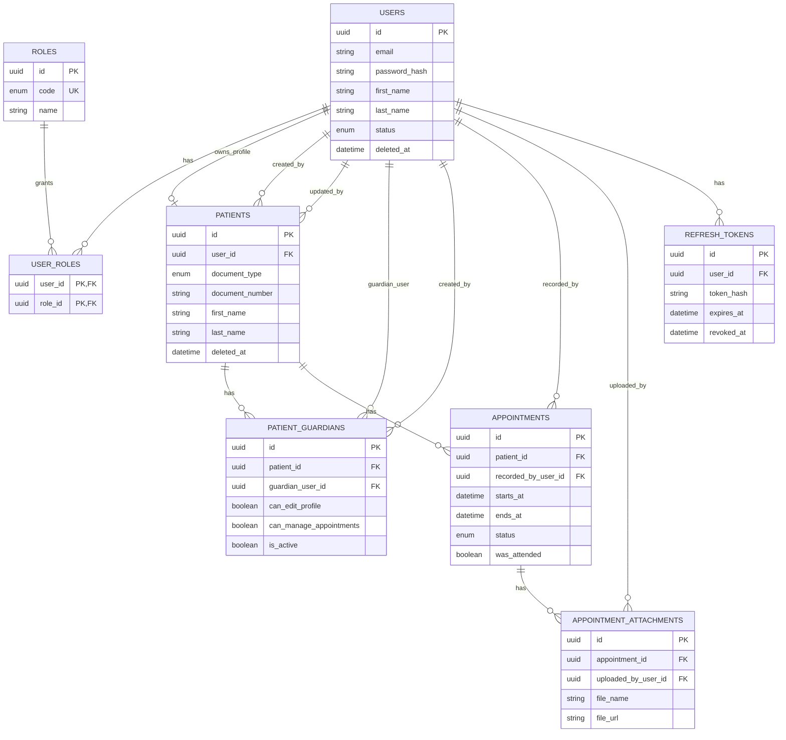

# Modelo Entidad-Relación (MVP actual)

## Normalización aplicada
- `roles` separado de `users` (N:M con `user_roles`).
- Relación de usuarios encargados desacoplada en `patient_guardians`.
- Adjuntos desacoplados de citas en `appointment_attachments`.
- Sesiones desacopladas en `refresh_tokens`.

## Decisiones prácticas para MVP
- Datos de doctor/centro se guardan como texto en `appointments`.
- No hay integración externa de centros/hospitales en esta etapa.
